# Irada: Backend API &nbsp; [](https://github.com/HattySohaib/Headless-CMS-Backend/actions/workflows/deploy.yml) &nbsp; 

Irada is a scalable, distributed ecosystem for modern content management, analytics, and embeddable widgets. This repository (`irada-backend`) contains the core API powering the system, built with Node.js, Express, and MongoDB, and deployed on AWS EC2.

> **Related Repositories:**  
> • [Irada Frontend (Admin Dashboard)](https://github.com/HattySohaib/irada-frontend)  
> • [Irada Widgets (Embeddable Library)](https://github.com/HattySohaib/irada-widgets)

---

## 📊 Architecture Diagram

```mermaid
graph LR
    %% Define Classes for Colors
    classDef user fill:#f9f9f9,stroke:#333,stroke-width:2px,color:black
    classDef frontend fill:#e6f7ff,stroke:#007acc,stroke-width:2px,color:black
    classDef backend fill:#e6fffb,stroke:#00bfa5,stroke-width:2px,color:black
    classDef data fill:#fffbe6,stroke:#ffc400,stroke-width:2px,color:black
    classDef devops fill:#f0e6ff,stroke:#7b1fa2,stroke-width:2px,color:black

    %% Define Nodes and Subgraphs
    subgraph "Users"
        direction TB
        AdminUser[/"🧑‍💻 Admin User"/]
        EndUser[/"👥 End User"/]
    end

    subgraph "Frontend Layer"
        direction TB
        Vercel["⚡️ Admin Dashboard (on Vercel)"]
        subgraph ThirdParty["3rd Party Website"]
            Widgets["🧩 Irada Widgets"]
        end
    end

    subgraph "Backend Layer (AWS)"
        direction TB
        subgraph EC2["🖥️ EC2 Instance"]
            direction LR
            BackendAPI["🟩 Node.js API"] <--> Redis["🗄️ Redis Cache"]
        end
    end

    subgraph "Data & Storage"
        direction TB
        MongoDB["🗄️ MongoDB Atlas"]
        S3["☁️ S3 Bucket"]
    end

    subgraph "CI/CD & Source Control"
        direction TB
        Developer[/"👨‍💻 Developer"/] --> GitHub["🐙 GitHub Repo"]
        subgraph GHA["🤖 GitHub Actions"]
            direction TB
            DeployBE["Deploy Backend"]
            DeployWidgets["Publish Widgets"]
        end
        GitHub --> GHA
        GitHub -- "Push to main" --> Vercel
        GHA -- "Docker Image" --> EC2
        GHA -- "npm publish" --> NPM["📦 npm Registry"]
    end

    %% --- Define Interactions ---
    AdminUser --> Vercel
    EndUser --> ThirdParty
    Vercel -- "HTTPS API Calls" --> BackendAPI
    Widgets -- "API Calls w/ Key" --> BackendAPI
    BackendAPI -- "Cache R/W" --> Redis
    BackendAPI -- "DB Query" --> MongoDB
    BackendAPI -- "File Storage" --> S3
    
    %% --- Apply Styles ---
    class AdminUser,EndUser,Developer user;
    class Vercel,ThirdParty,Widgets frontend;
    class EC2,BackendAPI,Redis backend;
    class MongoDB,S3 data;
    class GitHub,GHA,NPM,Developer devops;
```


*A diagram showing the interaction between the Frontend, Backend, Widgets, and deployment services.*

---

## ✨ System-Wide Features

- **Scalable Headless CMS:** A robust system for content management, designed as the core of a distributed system, aimed at making common features like blogs page, contact form, testimonials on sites - easy to add.
- **Real-Time Analytics:** A service to track and visualise how your blogs perform and how many messages you got.
- **4 Embeddable Widgets:** A library of four dynamic React widgets published on npm & unpkg, designed for easy integration - which fetch content from this Backend API service and show on your site.
- **Admin Dashboard:** A dedicated frontend for site owners to manage content (blogs), see messages, and view analytics.

---

## 🛠️ Full Tech Stack

| Layer           | Technologies                                                                                                                                                                                                                                                                                       |
|-----------------|----------------------------------------------------------------------------------------------------------------------------------------------------------------------------------------------------------------------------------------------------------------------------------------------------|
| **Frontend** |                                                    
| **Widgets** |                                                                                                                      |
| **Backend** |     |
| **Infrastructure** |     |
| **DevOps** |                                                                                        |
| **Security** |                                   |

---

## 🛡️ Security & Performance ⚡

This backend was engineered following system design principles for high security and performance.

-   **Robust Security:** Implemented a multi-layered security approach including **JWT Authentication**, **scoped API keys**, comprehensive **input validation/sanitization**, and **rate-limiting** on all critical endpoints.
-   **Optimized Latency:** Utilized **Redis caching** and efficient **query-based pagination**, which **slashed p95 latency from >2s to <500ms**.
-   **Proven Stability:** The system was benchmarked with **JMeter**, confirming stability and performance under a load of **1000 concurrent requests**.
-   **Scalable Architecture:** The application is fully containerized with **Docker**, uses **AWS S3** for scalable data storage, and its stateless design allows for horizontal scaling.

---

## 🚀 Deployment & CI/CD

Deployments are fully automated and cloud-native:
- **GitHub Actions**: CI/CD pipeline for build, test, and deploy.
- **Docker**: Application and dependencies are containerized.
- **Docker Compose**: Multi-service orchestration for local and production.
- **AWS EC2**: Production deployments on scalable compute instances.
- **S3**: Media and data assets stored on highly available object storage.

---

## 🔧 Local Development Setup

Thanks to Docker, setting up the entire backend environment—including the Node.js server, MongoDB database, and Redis cache—is handled with a single command.

**Prerequisites:** - Docker & Docker Compose installed  

**1. Clone the repository:**
```sh
git clone [https://github.com/HattySohaib/irada-backend.git](https://github.com/HattySohaib/irada-backend.git)
cd irada-backend
```
**2. Configure environment variables: Copy .env.example to .env and edit as needed:**

```Bash

cp .env.example .env
```
**3. Start all services locally:**
```Bash

docker-compose up --build
```
---
The API will be available at the port configured in your .env file (e.g., http://localhost:5000/api).
---

## 👨‍💻 About Me

This project was built by **Sohaib Aftab**. I am a final-year Computer Science student passionate about building scalable and performant software.

* **GitHub:** [@HattySohaib](https://github.com/HattySohaib)
* **LinkedIn:** [linkedin.com/in/your-linkedin-profile](https://www.linkedin.com/in/sohaibaftab/)

---

## 📄 License

Licensed under the ISC License.
